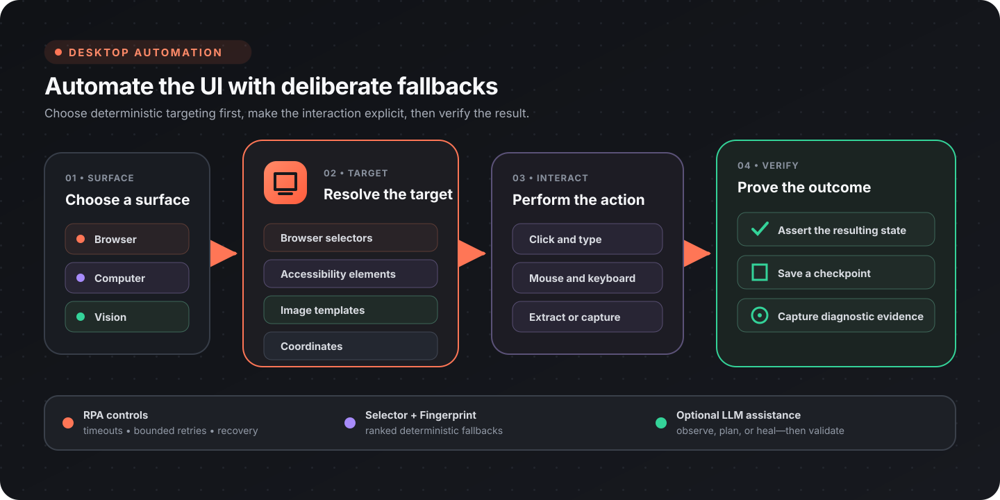

Flow-Like can automate browser pages and visible desktop applications from a Flow. The current Automation catalog includes direct browser and computer control, accessibility-based element lookup, template matching, reusable selectors, checkpoints, recovery helpers, and optional AI-assisted observation.

:::note[Run automation where the interface is available]
Browser and computer automation need a compatible local execution environment. Desktop interactions also depend on the operating system, active session, application, and permissions. Confirm those requirements on the machine that will run the Flow.
:::



## Choose the right automation surface

| Surface | Best for | How it targets elements |
|---------|----------|-------------------------|
| **[Browser](/nodes/automation/browser/)** | Web applications, forms, downloads, and page extraction | Browser selectors and page state |
| **[Computer](/nodes/automation/computer/)** | Native desktop applications and system UI | Accessibility elements, windows, coordinates, and direct input |
| **[Vision](/nodes/automation/vision/)** | Interfaces without stable selectors or accessibility metadata | Image templates, regions, and pixel colors |
| **[RPA](/nodes/automation/rpa/)** | Reliable orchestration around UI interactions | Retries, timeouts, checkpoints, assertions, and recovery |
| **[Selector](/nodes/automation/selector/)** | Reusable target definitions with multiple fallback strategies | Ranked selector sets |
| **[Fingerprint](/nodes/automation/fingerprint/)** | Matching a target across UI changes | Stored and compared element fingerprints |
| **[LLM](/nodes/automation/llm/)** | Observation, planning, and recovery when deterministic targeting is insufficient | Configured vision-capable models |

Prefer the most deterministic surface available. Browser selectors are usually better than screen coordinates for a web page; accessibility elements are usually better than image matching for a native control. Vision and LLM nodes are useful fallbacks, not substitutes for a stable target.

## Automation sessions

Use [Start Automation Session](/nodes/automation/automation-start-session/) at the beginning of a desktop automation and [Stop Automation Session](/nodes/automation/automation-stop-session/) when it finishes. Keeping the session explicit makes resource ownership and cleanup visible in the Flow.

A typical desktop recipe is:

1. Start an automation session.
2. Find or focus the target window.
3. Locate an accessibility element, template, or coordinate.
4. Perform the interaction.
5. Assert the expected result or take a checkpoint.
6. Stop the session on both success and failure paths.

## Browser automation

The Browser catalog covers the complete page lifecycle:

| Capability | Current nodes |
|------------|---------------|
| Lifecycle | **Open Browser**, **Attach to Browser**, **New Page**, **Close Page**, **Close Browser** (**Start WebDriver** and **Stop WebDriver** are kept only for existing Flows) |
| Context | **List Tabs**, **Select Tab**, **Enter Frame**, **Leave Frame**, **Handle Browser Dialog** |
| Navigation | **Go To URL**, **Go Back**, **Go Forward**, **Reload** |
| Interaction | **Click Element**, **Double Click Element**, **Right Click Element**, **Drag Element**, **Hover Element**, **Scroll Into View** |
| Input | **Type Text**, **Press Key**, **Key Chord**, **Select Option** |
| Waiting | **Wait For Selector**, **Wait Delay**, **Wait For Network Idle** |
| Extraction | **Get Text**, **Get Attribute**, **Get HTML**, **Execute JavaScript** |
| Capture | **Take Screenshot**, **Screenshot Element** |
| Files | Uploads, download directory configuration, download triggers, and download waiting |
| State | Cookie, local-storage, and session-storage operations |
| Diagnostics | Console logs, network requests, DOM snapshots, and accessibility snapshots |

### Recipe: submit a web form reliably

1. [Open Browser](/nodes/automation/browser/browser-open/) and create a [New Page](/nodes/automation/browser/browser-new-page/). Start the Network Observer before navigation if you plan to wait for network idle.
2. Navigate with [Go To URL](/nodes/automation/browser/navigation/browser-goto/).
3. Use [Wait For Selector](/nodes/automation/browser/wait/browser-wait-for/) before interacting.
4. Enter values with [Type Text](/nodes/automation/browser/input/browser-type-text/) and submit with [Click Element](/nodes/automation/browser/interact/browser-click/).
5. Wait for either the result selector or [network idle](/nodes/automation/browser/observe/browser-wait-for-network-idle/).
6. Capture the final state with [Take Screenshot](/nodes/automation/browser/capture/browser-screenshot/).
7. Close the browser in the cleanup path.

Use selector-based browser nodes for browser content. They accept the typed
Selector output as well as existing CSS strings. Keep the returned session
handle for the intended tab and frame; switching one branch does not retarget a
different branch's handle.

**Start Network Observer** must run before the requests you want to observe.
**Wait For Network Idle** uses outstanding requests from that observer. Basic
authentication credentials are restricted to the configured HTTP(S) origin and
are not exposed to page JavaScript.

[Select Option](/nodes/automation/browser/input/browser-select-option/) fails
when no option has the requested value, so a changed dropdown stops the Flow
instead of leaving the old selection in place. A `select` step in
**Execute Browser Action Plan** behaves the same way.

Coordinate-based desktop input is more fragile when zoom, layout, or window
position changes.

### Which browser runs a Flow

Browser nodes control Chrome or Microsoft Edge directly through the browser's
DevTools protocol. You do not need to install or start a WebDriver such as
chromedriver, and a run never downloads a browser.

[Open Browser](/nodes/automation/browser/browser-open/) launches its own browser
window with a fresh temporary profile, or with the folder in **Profile
Directory** when cookies and logins should persist between runs. **Browser
Type** decides which browser it looks for:

- **Chrome** uses an installed Google Chrome first (stable, then Beta, Dev and
  Canary), then Chromium on macOS and Linux, then Chrome for Testing if you
  installed it. On Linux, Chromium from Snap comes last, after Chrome for
  Testing.
- **Edge** uses an installed Microsoft Edge only.

When no matching browser is installed, the run fails with a message that lists
the locations searched. Install the browser that **Browser Type** names, set
**Browser Type** to the browser you have, or, for **Chrome**, open **Settings >
Automation** in Flow-Like Desktop and install Chrome for Testing (about 200 MB
from storage.googleapis.com; on Linux, read the AppArmor note below first). The
same page lists the browsers it detected, and updates and removes Chrome for
Testing. Chrome for Testing is not available for Windows on ARM; use Chrome or
Edge there.

Firefox and Safari are not supported yet. A Flow whose **Browser Type** is
Firefox or Safari fails with an error that asks for Chrome or Edge; support for
them is planned through WebDriver BiDi.

On Linux, Chromium from your distribution's package is used before Chrome for
Testing. Chromium from Snap, which is what Ubuntu runs for `chromium` and
`chromium-browser`, is used only when no other Chrome, Chromium or Chrome for
Testing is found. Snap Chromium keeps its temporary profiles in
`~/snap/chromium/common` and needs a **Profile Directory** inside your home
folder. If Flow-Like itself crashes, a Snap Chromium window can stay open;
close it yourself. Chromium from Flatpak is not used.

Ubuntu 23.10 and newer, and other distributions that restrict unprivileged
user namespaces with AppArmor, block the sandbox of Chrome for Testing.
Flow-Like checks this before launch: a run that would use Chrome for Testing
fails with a message that suggests Google Chrome, Microsoft Edge or the
`sysctl` command below, and the browser is never started without its sandbox.
Google Chrome, Microsoft Edge and Snap Chromium are not affected. On such a
system, do one of these:

- Install Google Chrome from Google's package. It is used before Chrome for
  Testing, so it also takes over from an installed Chrome for Testing.
- Install Microsoft Edge and set **Browser Type** to Edge.
- Use Snap Chromium. Chrome for Testing is used before it, so do not install
  Chrome for Testing, or remove it in **Settings > Automation**.
- To use Chrome for Testing anyway, allow unprivileged user namespaces with
  `sudo sysctl kernel.apparmor_restrict_unprivileged_userns=0`. This relaxes a
  security setting for the whole system and lasts until the next restart.

A **Profile Directory** cannot be your everyday Chrome or Edge profile, because
Chrome 136 and newer block automation there. Only one browser can use a profile
directory at a time, and a profile last opened by a newer browser version is
refused rather than downgraded.

### Attach to a running browser

[Attach to Browser](/nodes/automation/browser/browser-attach/) controls a Chrome
or Edge that is already running. **Debugger Address** decides how it connects:

| Debugger Address | Connects to |
|------------------|-------------|
| `host:port` or `http(s)://host:port` | A dedicated debugging browser started with `--remote-debugging-port` and its own `--user-data-dir` |
| Empty | Your everyday Chrome or Edge, after you allow remote debugging |
| `ws://` or `wss://` on another machine | The browser-level DevTools WebSocket of a remote browser service, such as `wss://browser.example.com/devtools/browser/<id>` |
| `ws://127.0.0.1:<port>/devtools/browser/<id>` or `ws://localhost:…` | Handled like an empty address: the everyday-browser connection, with its consent wait and download limits |

For a dedicated debugging browser on this computer, use `host:port`, not its
`ws://` URL. With a remote browser service, uploads and downloads would use
paths on the remote machine, so the file nodes are not supported there.

Start a dedicated debugging browser with its own profile folder, then enter
`127.0.0.1:9333` as the Debugger Address:

```text
# macOS
"/Applications/Google Chrome.app/Contents/MacOS/Google Chrome" --remote-debugging-port=9333 --user-data-dir="$HOME/flow-like-debug-profile"
# Windows (Command Prompt)
"C:\Program Files\Google\Chrome\Application\chrome.exe" --remote-debugging-port=9333 --user-data-dir="%LOCALAPPDATA%\flow-like-debug-profile"
# Windows (PowerShell)
& "C:\Program Files\Google\Chrome\Application\chrome.exe" --remote-debugging-port=9333 --user-data-dir="$env:LOCALAPPDATA\flow-like-debug-profile"
# Linux
google-chrome --remote-debugging-port=9333 --user-data-dir="$HOME/flow-like-debug-profile"
```

A Chrome installed for your user only lives in
`%LOCALAPPDATA%\Google\Chrome\Application` instead. Edge takes the same two
flags.

To attach to your everyday browser instead (Chrome 144 or newer, or an Edge
version that offers the same setting):

1. In that browser, open `chrome://inspect/#remote-debugging` and turn on
   **Allow remote debugging for this browser instance**.
2. Clear **Debugger Address** on **Attach to Browser**. For Edge, also set
   **Browser** on that node to Edge.
3. Run the Flow while a browser window is open. The browser asks **Allow remote
   debugging?**; click **Allow** within two minutes. It asks again on every run.

While the Flow is connected, the browser shows a banner saying it is controlled
by automated software. The Flow can read and change everything in that profile,
including cookies, saved logins and open tabs, so use this mode only for Flows
you trust.

After you allow remote debugging, your everyday browser usually listens on
`127.0.0.1:9222`, which is also the default Debugger Address. Attach to Browser
does not take over the everyday profile through that address; it stops and asks
you to clear the address. Use another port, such as 9333, for a dedicated
debugging browser.

Closing the automation session disconnects an attached browser; it does not own
the browser's lifetime. With your everyday browser, downloads stay in its own
download folder and **Set Download Directory** reports an error; use **Trigger
Download** and point **Wait For Download** at that folder. Downloads from popup
windows are not reported in this mode. With a dedicated debugging browser,
**Set Download Directory** changes that browser's download folder until it
restarts.

### Legacy WebDriver inputs

The **WebDriver URL** inputs on **Open Browser** and **Attach to Browser** remain
so existing Flows keep loading. A local address, such as the defaults
`http://localhost:9515` and `http://127.0.0.1:9515`, is ignored and the browser
is launched or attached directly. A remote WebDriver host, or a local WebDriver server other than
ChromeDriver or msedgedriver (for example geckodriver or Selenium Grid), makes
the node fail. **Start WebDriver** starts nothing and outputs a local address
for compatibility. **Stop WebDriver** closes the session's browser like **Close
Browser**. New Flows need neither node.

## Computer automation

Computer nodes interact with the active desktop session.

### Accessibility

[Get Accessibility Tree](/nodes/automation/computer/accessibility/computer-get-accessibility-tree/) inspects the accessible controls exposed by the current interface. [Find Accessibility Element](/nodes/automation/computer/accessibility/computer-find-accessibility-element/) locates a target from that structure.

**Act on Accessibility Element** invokes, focuses, or sets a value on the identified
native control. It checks that the target still matches before acting.

Accessibility targeting is the preferred starting point for native controls because it can remain stable across window movement and display scaling. Some custom-rendered applications expose little or no useful accessibility metadata; use Vision or a coordinate fallback for those interfaces.

### Windows and displays

The current Window nodes can:

- list windows and inspect the active window;
- find a window by title;
- focus a window;
- minimize, maximize, restore, move, resize, or close a window;
- capture a window;
- launch an application.

The Display nodes list displays and identify the primary display. Resolve the intended display or window before using absolute coordinates.

### Mouse, keyboard, and clipboard

The Computer catalog includes:

- **Mouse Move**, **Natural Mouse Move**, **Mouse Click**, **Mouse Double Click**, **Mouse Drag**, and **Scroll**;
- **Type Text** and **Key Press** for keyboard input;
- text and image clipboard getters and setters;
- **Wait** for deliberate pauses between interactions.

**Set Clipboard Text** and **Set Clipboard Image** also work outside desktop automation. They use the device API when the Event runs locally and ask the invoking frontend to copy the result when it runs remotely. Their automation session input is optional, and existing session connections still pass through. Clipboard readers continue to require local desktop execution.

A remote write needs a live client invocation. A scheduled or API-only run has no user clipboard to address. The write follows its success output only after the client acknowledges it; otherwise it follows the error output with a structured error. Browsers may show a **Copy result** button when they require a fresh click. Requests expire when their client timeout elapses or the run ends and are never executed from saved run output.

The optional **Keep on device** and **Expire after** inputs use iOS clipboard protections. A host that cannot enforce these options returns an error. Text is limited to 1 MiB and images to 16 MiB of PNG data. Writing clipboard content does not send a paste keystroke to another application.

Use [Natural Mouse Move](/nodes/automation/computer/mouse/computer-natural-mouse-move/) when the path itself matters. Use [Mouse Click](/nodes/automation/computer/mouse/computer-mouse-click/) or [Click At Position](/nodes/automation/rpa/rpa-click-at-position/) only after resolving the correct coordinates for the current session.

## Screen capture and visual targeting

The current catalog separates general computer capture from Vision helpers:

| Task | Node |
|------|------|
| Capture the desktop | [Screenshot](/nodes/automation/computer/capture/computer-screenshot/) |
| Capture a rectangular region | [Screenshot Region](/nodes/automation/vision/vision-screenshot-region/) |
| Save a capture to a file | [Screenshot To File](/nodes/automation/vision/vision-screenshot-to-file/) |
| Locate one template | [Find Template](/nodes/automation/vision/vision-find-template/) |
| Locate every matching template | [Find All Templates](/nodes/automation/vision/vision-find-all-templates/) |
| Find and click a template | [Click Template](/nodes/automation/vision/vision-click-template/) |
| Wait for appearance or disappearance | **Wait For Template** / **Wait Template Disappear** |
| Inspect the display | **Get Screen Size** / **Get Pixel Color** |

### Recipe: resilient template interaction

1. Capture a current region rather than searching an unnecessarily large display.
2. Use **Wait For Template** with a deliberate timeout.
3. Locate the template and inspect its match before clicking when the action is consequential.
4. Click with **Click Template** or use the returned position with a mouse node.
5. Assert that the expected follow-up template or color exists.
6. On failure, take a snapshot and enter a recovery path.

Template and fingerprint modes require a unique current target. A missing or
ambiguous match stops the action. Choose coordinate mode explicitly when a Flow
should click a fixed location without validating a visual or accessible target.

Template images should be cropped around a distinctive, stable control. Recreate
them when the target application's theme, display scaling, or visual design
changes.

## Reliability and recovery

RPA helpers make failures explicit instead of hiding them inside a long chain of UI actions.

| Concern | Useful nodes |
|---------|--------------|
| Bounded execution | **With Timeout**, **Delay**, **Calculate Elapsed** |
| Retry | [Retry Loop](/nodes/automation/rpa/rpa-retry-loop/), **Wait For Template**, **Wait For Color** |
| Assertions | **Assert Template Exists**, **Assert Color At Position** |
| Checkpoints | **Save Checkpoint**, **Parse Checkpoint**, [Take Snapshot](/nodes/automation/rpa/rpa-take-snapshot/) |
| Error paths | [Try Catch](/nodes/control/rpa-try-catch/) (Control), **Error Recovery**, **Diagnose Failure** |
| Audit trail | **Log Action** |

For an important interaction:

1. Bound the operation with a timeout.
2. Wait for a deterministic readiness signal.
3. Perform the action.
4. Assert the resulting state.
5. Retry only failures that are safe to repeat.
6. Capture diagnostic evidence before recovery or exit.

**With Timeout** cancels the action branch cooperatively. An operating-system or browser request already submitted may still complete, so verify the target state before retrying an action with external effects. Retry only when the operation is idempotent or you can determine whether it already succeeded.

## Selectors and fingerprints

Selectors let a Flow keep several ways to identify the same target. Build a selector, combine alternatives into a selector set, validate them, rank the candidates, and retrieve the best current match.

Fingerprints store descriptive target data that can be compared or updated later. They are useful when a target changes slightly between versions but retains enough stable characteristics to identify it.

Use these layers to make fallbacks deliberate:

1. stable browser or accessibility selector;
2. alternate selector or stored fingerprint;
3. template match;
4. coordinate fallback;
5. optional LLM-assisted resolution.

## Optional LLM assistance

LLM automation nodes cover three groups:

- **Vision**: observe or classify a screen, find or describe an element, extract structured information, resolve candidates, and rank matches;
- **Planning**: plan actions or suggest the next step;
- **Healing**: diagnose a failure and propose a repaired selector or template.

Use a configured model only when deterministic methods do not provide enough signal. Treat its output as a proposal: validate the selected target and add a bounded fallback before performing consequential actions.

**Plan Actions** defaults to general proposals, including native desktop targets.
To feed **Execute Browser Action Plan**, select its **Browser** execution target
and supply **Page Context** from a DOM or accessibility snapshot. Browser plans
must use selectors grounded in that context; the executor validates supported
actions and their parameters before running them.

:::caution[Review data handling]
Screen captures and extracted UI content may contain personal, confidential, or regulated information. If a Flow sends that content to a configured model or external service, the applicable provider, connection, and organizational policies govern where it is processed. Minimize the captured region and redact sensitive values when possible.
:::

## Recording

The recorder creates editable nodes from your actions. Native recording waits
for the input hook to start before showing a recording state. Stop it with the
configured global shortcut or the tray menu, including while another application
has focus. While Desktop stays open, a completed recording remains available until
you insert or clear it on its original profile, app, and board. Insert recordings
before quitting Desktop. Switching profiles stops active recording
and clears its preview. Opening another profile or board cannot insert or discard
the retained recording.

Native recording preserves mouse buttons, modifiers, scroll positions, window
focus, and clipboard shortcuts. Optional target images and accessibility
fingerprints use a recent hover sample from the same position and window,
taken before the click changes the control. If no matching sample is available,
the recording keeps the action coordinates. Inserting with template or fingerprint
replay enabled requires the corresponding sample; choose coordinate replay when
that evidence is unavailable.

Native recording cannot reliably identify secure fields, so typed or pasted
secrets can be saved. Pause before entering secrets and configure credentials
explicitly in the Flow.

For web pages, select browser recording and supply the debugger address of a
dedicated Chrome or Edge debugging browser, started with
`--remote-debugging-port` and its own `--user-data-dir` as described in
[Attach to a running browser](#attach-to-a-running-browser). Recording cannot
use the consent connection to your everyday browser. No WebDriver is needed:
replay launches or attaches to Chrome or Edge directly, and the recorder's
**Legacy WebDriver URL (not needed)** field can keep its default. A remote host
in that field makes replay fail. Browser recording creates selector-based actions, waits for
their targets, and keeps tab and frame context. It does not require desktop Input Monitoring. The
browser must expose its debugging endpoint before recording begins. Cross-origin
frames and shadow-DOM targets cannot currently be recorded as document selectors;
the recorder reports that limitation. Add frame or custom targeting steps to the
Flow when a page requires them. Password and file-input values are excluded
from browser recordings; configure those steps explicitly in the Flow.

## Permissions and operating-system behavior

[Automation approval](/studio/local-execution/#automation-approval-and-system-permissions)
is separate from operating-system access. Desktop inspects the actual workflow
revision, asks for its capabilities, and checks them again at native execution.
Background Events require a remembered approval.

| Platform | Native integration and requirements |
| --- | --- |
| macOS | Accessibility supports native element lookup and actions, window control, and input. Screen Recording is checked separately for captures. Native recording checks Input Monitoring and Accessibility for window identity. Grants belong to the current executable and signing identity. |
| Windows | Native elements use UI Automation. Input and window actions run in the interactive desktop; elevated applications and the secure desktop can reject them. |
| Linux with X11 | Input and capture require an accessible display. Window control uses native X11 messages and verifies the window manager's supported operations and resulting state. Native accessibility uses the AT-SPI session bus and the target application's exposed controls. |
| Linux with Wayland | Input control uses a compositor RemoteDesktop session retained for the app session. Select the displays to control in its portal; absolute movement requires their logical position and size. Pointer-location queries are unavailable through this backend. Capture availability depends on the screenshot backend and may require approval for each capture. Global native input recording and generic native window management are not available through this backend; browser recording and browser automation remain available. |
| iOS and Android | The desktop automation catalog is unavailable. Device clipboard operations use the separate device integration. |

The permission dialog identifies denied, unavailable, and unsupported
capabilities. Recheck after granting access. If macOS still reports denial,
quit and reopen the app and verify that System Settings lists the executable
you are running.

Test capture, input, and target lookup on the machine that will run the Flow.
Repeat that check after operating-system, application, theme, or display changes.

When upgrading an existing Flow, review collection connections on **Upload
Multiple Files**, **Observe Screen**, **Plan Actions**, **Rank Candidates**,
and **Resolve Element**. These nodes now declare their array item types.
Before catalog synchronization, migration checks the changed pins against their
new contracts and preserves compatible saved array literals and connections.
Repair values that fail the new item schema, and connections into typed inputs
from incompatible producers or generic producers whose item type cannot be
determined. Validate the Flow before running it. Existing CSS selector pins and
their connections are preserved alongside the added typed locator inputs.

Saved mouse nodes retain an explicitly enabled fingerprint option. Supply a
valid fingerprint or turn that option off for coordinate replay; missing target
evidence now stops the action.

## Design checklist

- Start with a stable target, not a fixed delay.
- Resolve the intended window, page, and display before interacting.
- Prefer selectors or accessibility metadata over coordinates.
- Keep retries bounded and safe to repeat.
- Assert the post-condition after important actions.
- Capture diagnostics without exposing secrets.
- Provide cleanup paths that close pages, browsers, and automation sessions.
- Test at the same display scaling and permissions used in production.

## Next steps

- Browse the complete [Automation node catalog](/nodes/automation/).
- Use [Document Processing](/topics/document-processing/overview/) for extracted documents and images.
- Use [API Integrations](/topics/api-integrations/overview/) when the target system exposes a reliable API.
- Use [Building Internal Tools](/topics/internal-tools/overview/) to create a control surface for an automation.
