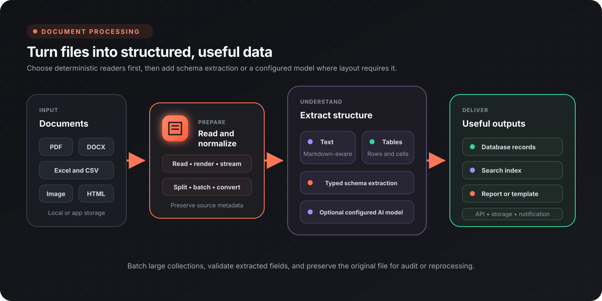

Flow-Like can read, transform, and extract structured information from document collections. Prefer deterministic readers and converters first, then add schema extraction or a configured AI model when layout or language makes rules insufficient.



## Choose a processing path

| Input | Start with | Add when needed |
|-------|------------|-----------------|
| Digital PDF | Text extraction or page rendering | AI extraction for complex visual layouts |
| Scanned PDF | Render pages to images | Vision-capable extraction and validation |
| Excel workbook | Cell, worksheet, or table nodes | AI table extraction for unusual layouts |
| CSV | Buffered reader or database registration | Batching and schema validation |
| Image | Read, inspect dimensions, crop, resize, convert | Barcode reading, annotation, or AI extraction |
| DOCX or PPTX | Native extraction and editing nodes | Template-specific replacement or generation |
| HTML | Convert to Markdown | Section or keyword extraction |

## PDF processing

### Inspect, render, and extract

| Need | Node |
|------|------|
| Count pages | [PDF Page Count](/nodes/image/pdf/pdf-page-count/) |
| Render one page | [PDF Page To Image](/nodes/image/pdf/pdf-page-to-image/) |
| Render every page | [PDF To Images](/nodes/image/pdf/pdf-to-images/) |
| Extract selectable text | [Extract Text](/nodes/document/pdf/pdf-extract-text/) |
| Split or extract page ranges | [Split PDF](/nodes/document/pdf/pdf-split/), [Extract Pages](/nodes/document/pdf/pdf-extract-pages/) |
| Rotate pages | [Rotate Pages](/nodes/document/pdf/pdf-rotate-pages/) |
| Merge files | [Merge PDFs](/nodes/document/pdf/pdf-merge/) |

Use text extraction for digitally generated PDFs. Render pages when downstream work depends on the visual layout or when the source is scanned.

### AI-assisted extraction

[AI Extract Document](/nodes/ai/processing/ai-processing-extract-document-ai/) can describe images and recover content from visually complex documents. [AI Extract Documents](/nodes/ai/processing/ai-processing-extract-documents-ai/) handles multiple files in parallel.

Pass a configured model that supports the source format. Do not hard-code a vendor-specific model name into reusable boards. Model availability and capabilities depend on the configured provider.

For structured output, define a schema and validate the extracted values before writing them. An invoice schema might look like:

```json
{
  "vendor": "string",
  "invoice_number": "string",
  "date": "date",
  "line_items": [
    {
      "description": "string",
      "quantity": "number",
      "price": "number"
    }
  ],
  "total": "number"
}
```

Use deterministic checks for totals, dates, identifiers, and required fields. Route low-confidence or invalid records to review instead of silently accepting them.

## Spreadsheet processing

### Cells and worksheets

| Need | Node |
|------|------|
| Read a cell | [Excel Read Cell](/nodes/data/excel/excel-read-cell/) |
| Write a cell | [Excel Write Cell](/nodes/data/excel/excel-write-cell/) |
| List sheets | [Get Sheet Names](/nodes/data/excel/files-spreadsheet-get-sheet-names/) |
| Create a sheet | [New Worksheet](/nodes/data/excel/files-spreadsheet-new-worksheet/) |
| Copy a sheet | [Copy Worksheet](/nodes/data/excel/files-spreadsheet-copy-worksheet/) |

### Tables

Use [Extract Tables (Excel)](/nodes/data/excel/data-excel-extract-tables/) for predictable workbook layouts. Use [Extract Tables AI (Excel)](/nodes/data/excel/data-excel-extract-tables-ai/) when tables have irregular headers, spacing, or multiple regions that deterministic extraction cannot identify reliably.

For either path:

1. inspect sheet names and choose the intended worksheet;
2. define expected columns and types;
3. normalize headers;
4. validate row counts and required fields;
5. preserve the source workbook or a stable reference to it.

## CSV processing

[Buffered CSV Reader](/nodes/utils/csv/csv-buffered-reader/) reads large CSV files in batches. Keep the batch size appropriate to row width and downstream work, and validate the header before processing the first batch.

CSV files can also be registered in a DataFusion session and queried with SQL:

```sql
SELECT
  c.name,
  SUM(s.amount) AS total
FROM sales AS s
JOIN customers AS c
  ON s.customer_id = c.id
GROUP BY c.name
ORDER BY total DESC;
```

SQL is useful for joins, aggregation, and filtering, but it does not replace source validation. Confirm delimiters, quoting, encoding, and numeric or date conventions when files come from multiple systems.

## Image processing

| Need | Node |
|------|------|
| Load an image | [Read Image](/nodes/image/content/read-image/) |
| Read dimensions | [Get Dimensions](/nodes/image/metadata/get-dimensions/) |
| Resize | [Resize Image](/nodes/image/transform/resize-image/) |
| Crop | [Crop Image](/nodes/image/transform/crop-image/) |
| Convert color representation | [Color Convert](/nodes/image/transform/convert-image/) |
| Adjust contrast | [Contrast](/nodes/image/transform/contrast-image/) |
| Read a QR code or barcode | [Read QR-/Barcode](/nodes/image/content/read-barcodes/) |
| Draw review annotations | [Draw Boxes](/nodes/image/annotate/draw-boxes/) |
| Save an image | [Write Image](/nodes/image/content/write-image/) |

Resize large scans before model-based extraction when the reduced image still preserves the required text. Keep the original file for audit, reprocessing, or a higher-resolution retry.

## DOCX and presentation files

The document catalog includes native operations for office files:

- [Extract Text from DOCX](/nodes/document/docx/docx-extract-text/), replace text or images, merge documents, and build documents from paragraphs, tables, images, and links.
- [Extract Text from PPTX](/nodes/document/pptx/pptx-extract-text/), replace slide content, merge presentations, and add slides, tables, charts, shapes, or speaker notes.

Use placeholder and replacement operations for controlled templates. Use native creation nodes when the workflow needs to assemble a new document from structured data.

## Text and template processing

| Task | Node |
|------|------|
| Convert HTML to Markdown | [HTML to Markdown](/nodes/utils/markdown/utils-md-html-to-md/) |
| Extract content sections | [Extract Content Sections](/nodes/ai/processing/ai-processing-extract-content-sections/) |
| Extract deterministic keywords | [RAKE Keywords](/nodes/ai/processing/ai-processing-rake-extraction/), [YAKE Keywords](/nodes/ai/processing/ai-processing-yake-extraction/) |
| Extract semantic keywords | [AI Keywords](/nodes/ai/processing/ai-processing-ai-keyword-extraction/) |
| Summarize a document | [Summarize Document](/nodes/ai/processing/ai-processing-summarize-document/) |
| Render a text template | [Render Template](/nodes/utils/string/string-render-template/) |

Choose deterministic keyword extraction when reproducibility and cost matter most. Use a model when the task depends on meaning rather than surface terms, and record the provider and model configuration with the run when reproducibility matters.

## Batch-processing pattern

For a folder or upload collection:

1. enumerate the input files;
2. identify or validate each file type;
3. send each type through its dedicated reader;
4. normalize all results into a shared schema;
5. validate required fields and business rules;
6. store the structured result and source reference;
7. route failures or uncertain extractions to review;
8. emit a summary with processed, skipped, reviewed, and failed counts.

Limit concurrency for large documents and external model calls. A large collection should be restartable, so save progress or make each file operation idempotent.

## Quality and safety checklist

- [ ] File type is validated instead of trusted from the extension alone
- [ ] Original files or stable source references are retained
- [ ] Deterministic extraction is preferred where it is sufficient
- [ ] Model choice is configurable and supports the input format
- [ ] Required fields and business rules are validated
- [ ] Large collections are batched and concurrency-limited
- [ ] Low-confidence results have a review path
- [ ] Sensitive document content is not exposed in logs
- [ ] Output records include provenance back to the source

## Related guides

- [Summarization strategies](/topics/document-processing/summarization-strategies/)
- [Data pipelines](/topics/data-pipelines/overview/)
- [API integrations](/topics/api-integrations/overview/)
- [Node catalog](/nodes/overview/)
