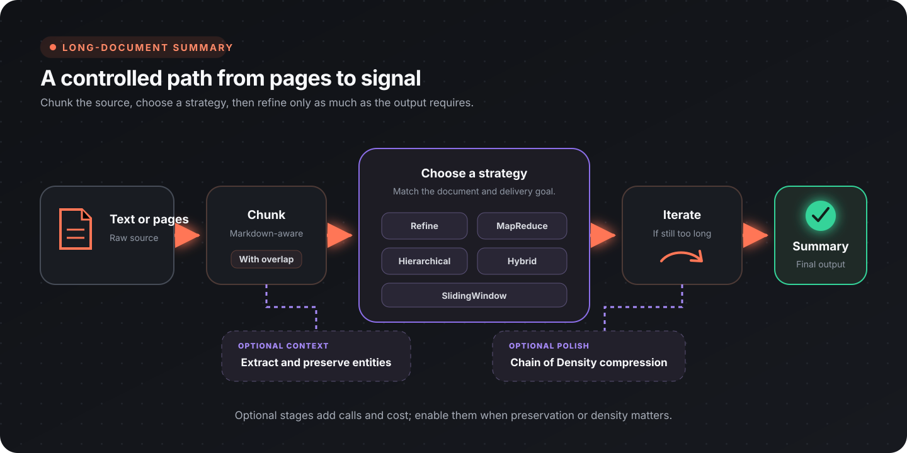

Flow-Like provides a shared summarization engine used by both the **Summarize** node (raw text) and the **Summarize Document** node (document pages). This guide explains the available strategies, when to use each, and how to tune them.

## How It Works

Long text is split into chunks, processed by the chosen strategy, and optionally post-processed with Chain of Density compression. The pipeline:

## Strategy Comparison

| Strategy | Parallelism | Coherence | Structure-Aware | LLM Calls | Best For |
|----------|:-----------:|:---------:|:---------------:|:---------:|----------|
| **Refine** | None | ★★★★★ | No | N | Narratives, meeting notes |
| **MapReduce** | Full | ★★★ | No | N + reduce | Speed-critical, large docs |
| **Hierarchical** | Partial | ★★★★ | Yes | Sections + merges | Reports, papers with headings |
| **Hybrid** | Map phase | ★★★★ | No | N + K refine | Balance of speed & quality |
| **SlidingWindow** | None | Strongest on recent context | No | N + compressions | Very long or streaming inputs |

### Refine

Processes chunks **sequentially**. Each step receives the accumulated summary so far plus the next chunk, producing a rolling summary.

**Pros:**
- Strong narrative coherence because the model sees the accumulated summary
- Simple, predictable behavior
- Works well with small models

**Cons:**
- No parallelism — wall-clock time scales linearly with chunk count
- Later chunks may be under-represented as the summary grows
- Single point of failure if one chunk produces a bad summary

**When to use:** Documents where order matters (chronological reports, meeting transcripts, legal documents).

### MapReduce

Summarizes each chunk **independently** in parallel, then recursively merges the partial summaries.

**Pros:**
- Fastest strategy — map phase is fully parallelizable
- Scales well with concurrency setting
- Each chunk gets equal attention

**Cons:**
- Chunks are isolated during mapping — information spanning boundaries is lost
- Reduce phase may distort relative importance
- Requires more total LLM calls than Refine

**When to use:** Large documents with uniformly important content, speed-critical pipelines, high-concurrency environments.

### Hierarchical

Detects **document structure** (markdown headings) and builds a summary tree. Sections are summarized independently, then merged level by level.

**Pros:**
- Respects the author's original organization
- Produces section-level summaries as a byproduct
- Natural fit for technical documentation

**Cons:**
- Requires detectable headings — falls back to balanced tree if none found
- Deep hierarchies multiply LLM calls
- Less effective for unstructured text

**When to use:** Technical reports, academic papers, documentation with clear heading structure.

### Hybrid

Combines **MapReduce** (parallel map phase) with **Refine** (sequential polish over the map outputs).

**Pros:**
- Captures MapReduce speed for initial processing
- Refine pass restores narrative coherence
- Good trade-off for most real-world documents

**Cons:**
- Highest total LLM cost (map + refine)
- More complex failure modes
- Diminishing returns on very short documents

**When to use:** Large documents where you want both speed and a coherent final output.

### SlidingWindow

Maintains a **fixed-size memory buffer** that is compressed whenever it exceeds a budget. Each new chunk is integrated into the buffer, and a final synthesis pass produces the output.

**Pros:**
- Constant memory usage regardless of document length
- Handles arbitrarily long documents
- Good for streaming/real-time scenarios

**Cons:**
- Early content may be aggressively compressed and lose detail
- Recent chunks are over-represented in the final output
- Memory budget tuning affects quality significantly

**When to use:** Very long documents, streaming ingestion, and memory-constrained environments.

## Chain of Density Post-Processing

After the main strategy produces a summary, **Chain of Density** (CoD) iteratively refines it to increase information density while maintaining the same length. Each step identifies 1–3 missing entities and rewrites the summary to include them.

Based on [research by Adams et al. (2023)](https://arxiv.org/abs/2309.04269), step 3 produces summaries closest to human preference:

| Step | Information Density | Readability | Recommendation |
|:----:|:-------------------:|:-----------:|:--------------:|
| 1 | Low | Very easy | Casual overviews |
| 2 | Medium | Easy | General audiences |
| **3** | **Optimal** | **Balanced** | **Default — most use cases** |
| 4 | High | Moderate | Technical audiences |
| 5 | Very high | Dense | Maximum compression |

**Tip:** Evaluate CoD with the configured model before enabling it in production. Density revisions require the model to preserve facts while rewriting under a length constraint.

## Entity Tracking

When enabled, the engine extracts named entities (people, organizations, dates, technical terms) from a sample of chunks *before* summarization begins. These entities are injected as context into every LLM call.

**Impact:**
- Adds 2–3 extra LLM calls for extraction
- Significantly improves factual preservation, especially with MapReduce
- Extracted entities are available in the output for downstream use

**Best paired with:** MapReduce and Hybrid (where chunks are processed independently and most likely to lose cross-chunk entities).

## Configuration Guide

### Chunk Size & Overlap

| Setting | Default | Description |
|---------|:-------:|-------------|
| Chunk Size | 8000 chars | Maximum characters per chunk. Reduce for models with smaller context windows. |
| Chunk Overlap | 10% | Percentage of overlap between adjacent chunks (0–50%). Higher values prevent boundary information loss but increase total chunks. |

**Rule of thumb:** Set chunk size to roughly 60–70% of your model's context window (in characters) to leave room for the system prompt and output.

### Concurrency

Controls parallel requests for MapReduce and Hybrid strategies.

| Value | Behavior |
|:-----:|----------|
| 0 | Unlimited — all chunks processed at once |
| 1 | Sequential (equivalent to disabling parallelism) |
| 4 | Default — good balance for most API rate limits |

### Model Selection

- Choose a model with enough context for the configured chunk, instructions, accumulated summary, and output.
- Evaluate factual preservation, coverage, and instruction following on representative documents.
- Use bounded concurrency that fits the provider's rate limits.
- Treat Chain of Density and entity tracking as independent quality/cost choices and evaluate them with the selected model.
- The summarization strategies use text generation; tool use is not required.

## Quick Decision Tree

