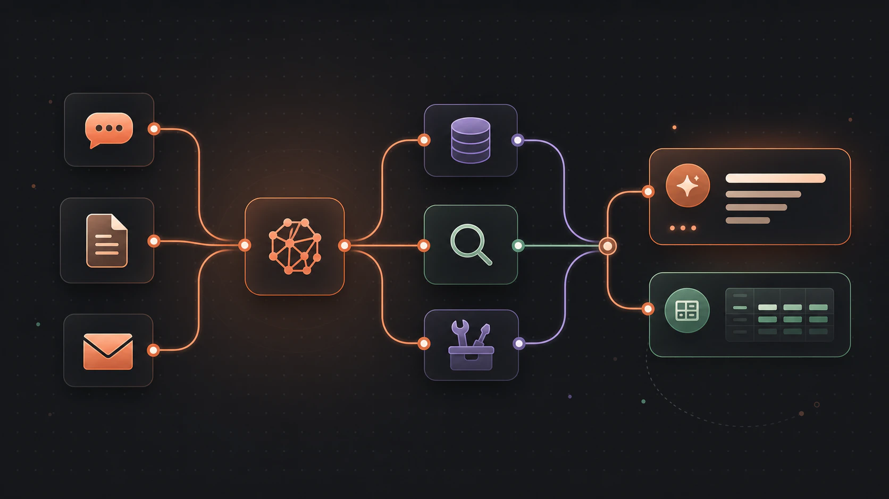

Flow-Like combines configured AI models with typed workflow nodes for chat, retrieval, extraction, and tool use. The Flow remains responsible for selecting context, granting capabilities, validating results, and delivering the final output.

:::tip[Keep the workflow in control]
Use the model for language or adaptive decisions. Keep permissions, business rules, side effects, and output validation explicit in the surrounding Flow.
:::

## What you can build

| Application | Flow-Like role |
|-------------|----------------|
| **Chatbots and assistants** | Manage conversation history, streaming, attachments, and session state |
| **Knowledge bases (RAG)** | Index source material, retrieve relevant passages, and carry evidence into the answer |
| **Structured extraction** | Constrain model output with a schema, then validate it before use |
| **Tool-using agents** | Give a model a bounded set of Flow functions, MCP tools, or analytical capabilities |
| **Content workflows** | Draft, summarize, classify, or transform content inside a repeatable process |

## Choose the capability

### Models and providers

Models supply generation, embedding, vision, or tool-use capabilities. Flow-Like supports hosted and local provider connections; the features available to a Flow depend on the configured model.

[Configure AI models and providers](/topics/genai/models/).

### Chat and conversations

Start a conversational Flow with a Chat Event, apply instructions and context, invoke a model, then return a complete response or stream chunks to the chat surface.

[Build chat and conversation workflows](/topics/genai/chat/).

### RAG and knowledge bases

Keep indexing separate from answering: split and embed source material once, then embed each question, retrieve evidence, and add only the selected passages to model context.

[Build a RAG workflow](/topics/genai/rag/).

### AI agents

Use an agent when the request requires the model to choose among approved tools. The Flow still controls the tool set, permissions, iteration limits, confirmation, and delivery.

[Build a controlled AI agent](/topics/genai/agents/).

### Extraction and structured output

Use a runtime schema when a downstream node needs a known JSON shape. Schema validation confirms structure, not factual correctness, authorization, or business validity.

[Extract and validate structured output](/topics/genai/extraction/).

## Quick example: a model-backed chat

A minimal chat Flow has three required boundaries:

1. [**Chat Event**](/nodes/events/events-chat/) receives the current conversation and session context.
2. [**Invoke Model**](/nodes/ai/generative/ai-generative-invoke/) sends the prepared history to the configured model.
3. [**Push Response**](/nodes/events/chat/events-chat-push-response/) returns a complete result, or [**Push Chunk**](/nodes/events/chat/events-chat-push-response-chunk/) delivers a streamed result incrementally.

Add a system message, retrieval, tools, or structured validation only when the use case needs them.

## Choose the right starting point

| Goal | Start here |
|------|------------|
| Build a conversational assistant | [Chat and conversations](/topics/genai/chat/) |
| Answer from a controlled document collection | [RAG and knowledge bases](/topics/genai/rag/) |
| Extract fields from text or documents | [Extraction and structured output](/topics/genai/extraction/) |
| Let a model choose among approved operations | [AI agents](/topics/genai/agents/) |
| Select a hosted or local model | [AI models and setup](/topics/genai/models/) |
| Render model-produced charts in markdown | [Prompt templates for rendering](/topics/genai/prompt-templates/) |

## Before you build

Make sure you have:

1. an App and Flow with a defined input and output contract;
2. an active profile with the required hosted-provider credentials or local-model endpoint;
3. a configured model that supports the capabilities the Flow uses;
4. representative examples for testing success, empty input, invalid output, and failure paths.

See [Model setup](/start/models/) for profile configuration.

:::note[Capabilities vary by model]
Vision, tool use, structured output, context size, and streaming support are model-specific. Choose from the capabilities reported by the configured provider instead of assuming that every model supports the same workflow.
:::
