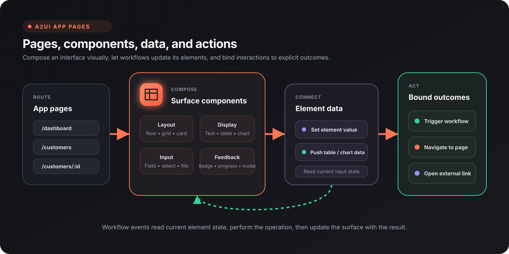

Flow-Like's **A2UI (Agent-to-UI)** system combines visual pages with workflow-backed data and actions. Use it for dashboards, admin panels, forms, reports, and other task-focused interfaces inside a Flow-Like app.



## What you can build

| Tool type | Common use cases |
|-----------|------------------|
| Dashboards | KPI displays, operational metrics, system status |
| Admin panels | User management, moderation, configuration |
| Data viewers | Search, record browsers, logs, review queues |
| Forms | Data entry, approvals, surveys, intake |
| Reports | Filtered views, summaries, export controls |
| Control centers | Start workflows, monitor work, review outcomes |

## Core concepts

### Pages and routes

An app can contain multiple pages. Each page has a route such as `/dashboard`, `/customers`, or a parameterized route such as `/customers/:id`.

Use a **Link** component for visible navigation or a `navigate_page` action when an interaction should change the route. Navigation actions may include query parameters for filters or view state. See [Pages](/apps/pages/) and [Routes](/apps/routes/) for the current builder workflow.

### Components

A2UI components cover layout, display, input, feedback, data visualization, and more:

| Group | Examples |
|-------|----------|
| Layout | Row, Column, Grid, Card, Tabs, Accordion, Drawer |
| Display | Text, Markdown, Badge, Avatar, Progress, Table |
| Input | TextField, Select, Checkbox, Switch, Slider, DateTimeInput, FileInput |
| Interaction | Button, Link, Modal, Tooltip, Popover |
| Visualization | NivoChart, PlotlyChart, GeoMap |

The **Table** component supports columns, sorting, search, pagination, row selection, and row-click behavior. **NivoChart** exposes a broad set of chart types; choose the chart from the data relationship rather than from decoration.

### Element data

Component properties define the initial surface. Workflows can then read current element state and push updates back into the page.

| Task | Relevant nodes |
|------|----------------|
| Read an input value | [Get Element Value](/nodes/ui/elements/a2ui-get-element-value/) |
| Read uploaded files | [Get File Input Files](/nodes/ui/elements/files/a2ui-get-file-input-files/) |
| Update a value | [Set Element Value](/nodes/ui/elements/a2ui-set-element-value/) |
| Update text or Markdown | [Set Element Text](/nodes/ui/elements/a2ui-set-element-text/), [Set Markdown Content](/nodes/ui/elements/display/a2ui-set-markdown-content/) |
| Replace table data | [Push CSV to Table](/nodes/ui/elements/table/a2ui-write-csv-to-table/), [Update Table](/nodes/ui/elements/table/a2ui-update-table/) |
| Replace chart data | [Push Data to Chart](/nodes/ui/elements/charts/a2ui-push-csv-to-chart/) |
| Show progress | [Set Element Loading](/nodes/ui/elements/a2ui-set-element-loading/), [Set Progress](/nodes/ui/elements/display/a2ui-set-progress/) |

This read-operate-update cycle keeps the event boundary explicit. A workflow event reads the element values it needs, performs the operation, and updates the affected surface elements.

### Actions

The page builder exposes three built-in action outcomes:

| Builder label | Action name | Required context |
|---------------|-------------|------------------|
| Trigger Workflow | `workflow_event` | `nodeId` |
| Navigate to Page | `navigate_page` | `route`; optional `queryParams` |
| External Link | `external_link` | `url` |

A button that triggers a workflow uses this action shape:

```json
{
  "name": "workflow_event",
  "context": {
    "nodeId": "evt-submit-form"
  }
}
```

Do not encode form values into this action context. The event reads the current values with **Get Element Value** or **Get File Input Files**. This avoids stale payloads and keeps the action contract focused on routing the interaction.

## Build a dashboard

1. Add a page and choose a stable route such as `/dashboard`.
2. Compose the page from Grid, Card, Text, chart, and Table components.
3. Add an initialization workflow that queries the required data.
4. Push each result into the corresponding text, chart, or table element.
5. Add loading, empty, and error states.
6. Add explicit drill-down navigation for details.

For a data table, define only the columns users need to scan or act on. Enable search, sorting, pagination, or selection when the underlying task requires them; avoid turning every available option on by default.

## Build a form

1. Lay out labels and inputs in a predictable reading order.
2. Give every input a stable element ID.
3. Bind the submit button to a `workflow_event`.
4. In the event workflow, read each input's current value.
5. Validate on the workflow side before writing data or calling an API.
6. Update field errors, loading state, and success feedback.
7. Navigate only after the operation has succeeded.

Use the appropriate input type for the value. For example, use Select for constrained choices and FileInput for uploads rather than parsing an unconstrained text field later.

## Tables and charts

### Tables

Tables work best when the workflow returns a stable row shape. Define:

- column keys and labels;
- whether each column is sortable or searchable;
- pagination and page size;
- selection behavior;
- the result of a row click, if any.

Keep destructive actions separate from row navigation and ask for confirmation before the workflow performs the destructive operation.

### Charts

Use NivoChart for common analytical charts and PlotlyChart for more specialized scientific or exploratory views. A useful chart has:

- a clear question or comparison;
- labeled dimensions and measures;
- consistent units and number formatting;
- an empty state;
- enough contrast in both light and dark themes.

The chart update nodes let a workflow replace data or configuration without rebuilding the rest of the page.

## Reusable widgets

Use [Widgets](/apps/widgets/) when a piece of interface and behavior should be reused across pages. Keep widget inputs small and intentional. Page-level workflows should still own business operations, validation, and data access.

## Responsive and accessible layouts

- Start with a single-column reading order, then add columns where space permits.
- Keep primary actions reachable without horizontal scrolling.
- Use visible labels, not placeholders alone, for inputs.
- Preserve keyboard focus and logical tab order.
- Pair color with text or icons for status.
- Check charts, borders, disabled states, and validation messages in light and dark mode.

## Design checklist

- [ ] Every page has a stable route
- [ ] Interactive elements have stable IDs
- [ ] Workflow events read current element state
- [ ] Loading, empty, error, and success states are present
- [ ] Destructive actions require confirmation
- [ ] Tables expose only task-relevant controls
- [ ] Navigation and external links use the correct action type
- [ ] Layout and contrast work in light and dark mode

## Next steps

- [Pages](/apps/pages/)
- [Routes](/apps/routes/)
- [Widgets](/apps/widgets/)
- [Events](/apps/events/)
- [API integrations](/topics/api-integrations/overview/)
- [Data visualization](/topics/datascience/visualization/)
