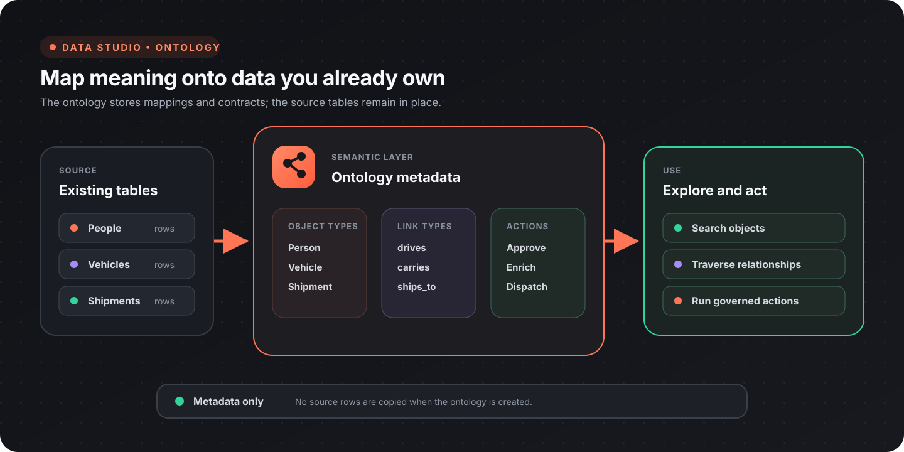
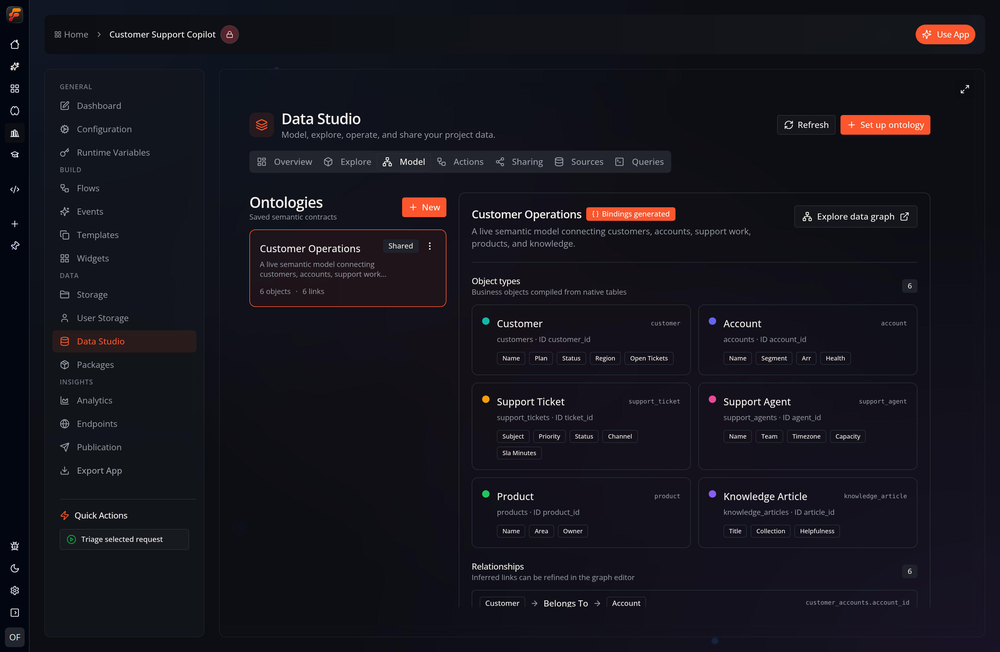
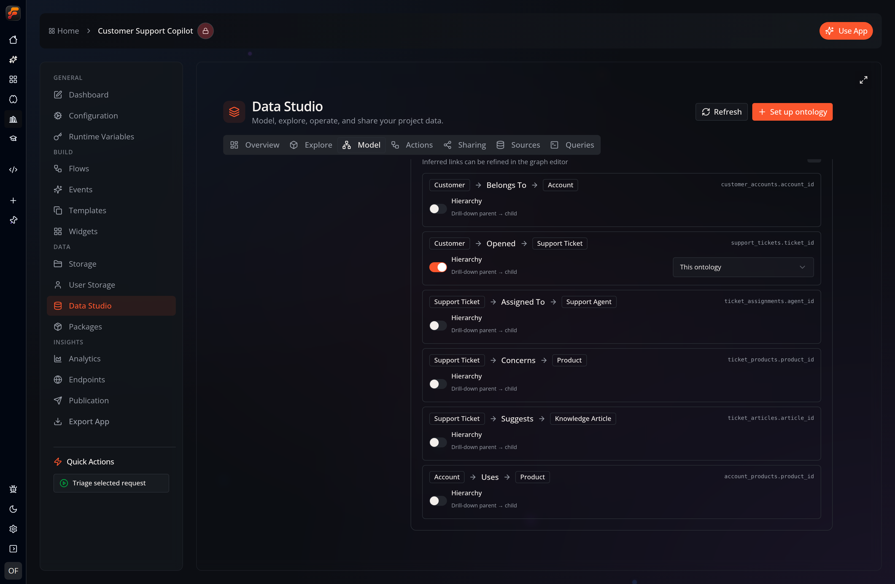
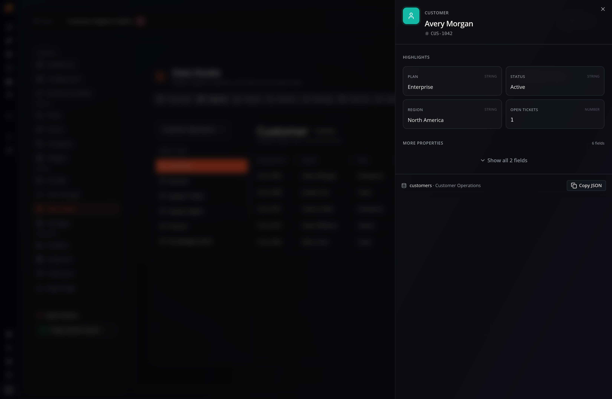
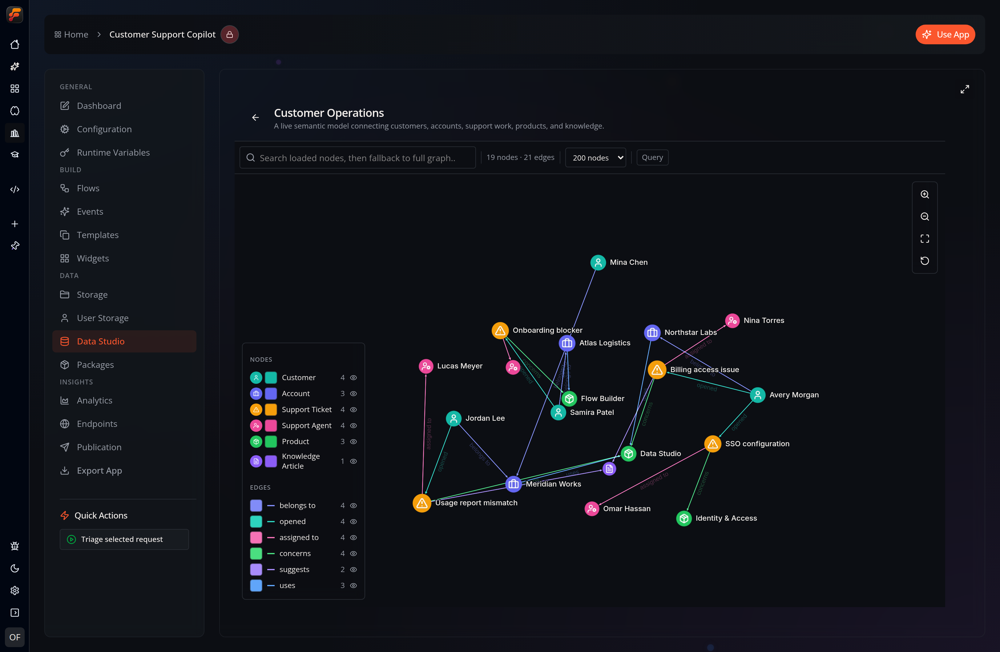
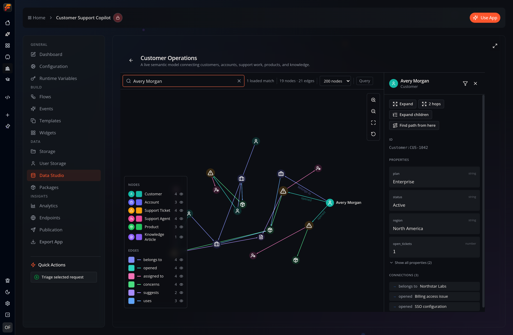
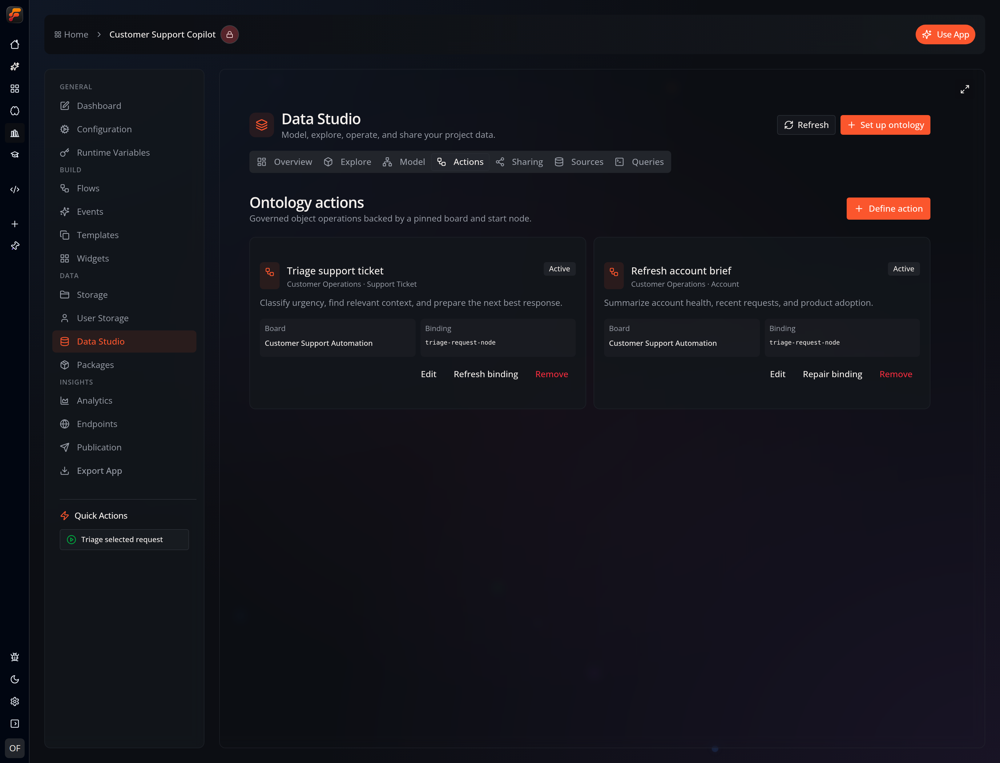
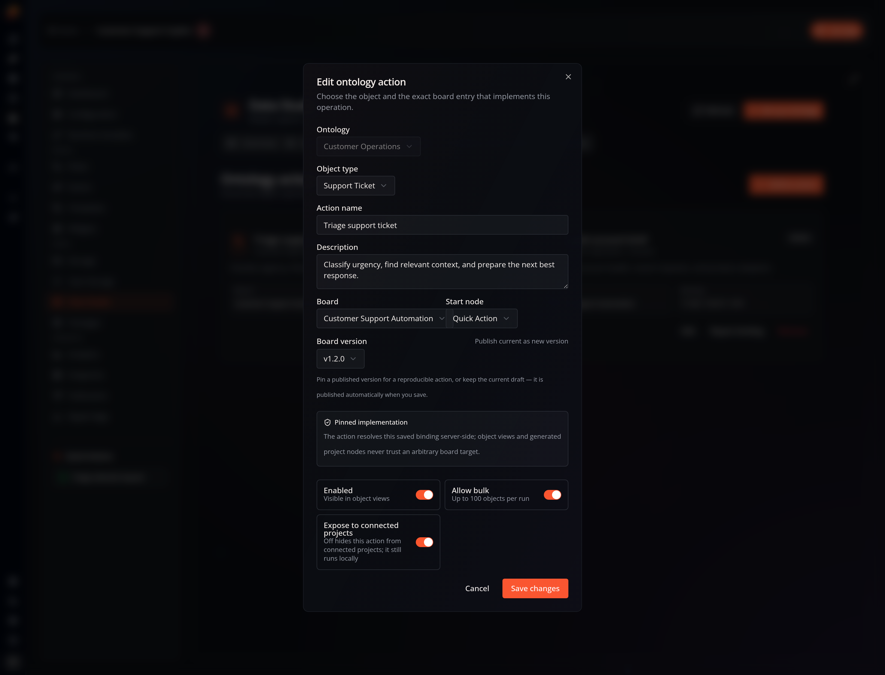

An **ontology** is a semantic layer you place over the database tables you already have. Instead of thinking in rows and columns, you describe your data as **object types** (Person, Vehicle, Shipment…) connected by **link types** (drives, ships_to, works_at…). Flow-Like then lets you search, traverse, visualize, and run governed actions on those objects — a full knowledge graph — without moving or copying any data.

:::tip[Nothing is duplicated]
An ontology is **metadata only**. It maps your existing tables to object and link types; the tables stay exactly as they are and keep working as normal databases. You can define many ontologies over the same tables.
:::

## Where it lives

Everything is in **[Data Studio](/apps/data-studio/)**, an app's **Data → Data Studio** view. Data Studio has these tabs:

| Tab | What it's for |
|-----|---------------|
| **Overview** | At-a-glance counts (ontologies, object types, actions, shared, and remote) and shortcuts into the other tabs |
| **Explore** | Browse objects of each type in a preview table and open an object's inspector — its views and available actions |
| **Model** | Create, rename, and delete ontologies; review object types and relationships; open the data graph |
| **Actions** | Define governed operations that run on an object type |
| **Sharing** | Expose your ontology to connected projects, and install ontologies from others |
| **Sources** | Create and inspect project or personal native tables, plus object types from installed remote ontologies |
| **Queries** | Run SQL over native tables, ontology overlays, or installed remote contracts and visualize the results |

## The building blocks

### Object types

An **object type** maps one table to a kind of entity. Each object type has:

- **Object name** — the human-readable label (e.g. `Sales Order`). Free-form; spaces are fine.
- **API name** — a stable identifier used by generated nodes and the API. Sanitized to letters, digits, and underscores, derived from the object name by default, and editable.
- **Unique ID** — the column that uniquely identifies each object.
- **Display property** — an optional human-readable caption (e.g. a name or title); defaults to the unique ID.
- **Property columns** — the columns projected onto each object.

### Link types

A **link type** maps a table to a relationship between two object types — a source object, a target object, and the columns that hold their IDs. Link types power traversal ("who does this person know?"), path finding, and the graph view.

### Graph overlay

An **overlay** is the whole ontology: its object types, link types, styling, object views, and actions, stored as a single metadata record inside the same database as the tables it references. Because it lives next to the data, scope is automatic — a **project** overlay lives in the project database, a **user** overlay in the user database.

The Model view is the saved semantic contract. It makes the mapping explicit: every object points to a source table and identity column, and every relationship names its source and target types.

## Hierarchy & composition

Any link type can be marked as **containment** — a parent → child hierarchy edge. The link's **source** object type is the parent and its **target** is the child (for example `Department → Person`, or a self-referential `Department → Department`). Containment turns a flat set of object types into a drill-down tree you can expand and collapse on demand, following only the hierarchy edges rather than every relationship.

A containment link can also reach **into another ontology**, so you can build one ontology out of others:

- **Another local ontology** — the child objects are defined by a different overlay over the same database.
- **An installed [remote ontology](/topics/ontology/remote/)** — the child subtree lives in a connected project.

This lets you model something like `Plant → Departments → People → HR`, where each level may be owned by a different ontology, and drill in only as far as you need.

### Drilling in

In the **Explore** data graph, expanding a parent object loads just its direct containment children — lazily, one level at a time — and collapsing hides the subtree again. Children mapped by another local ontology are loaded from that ontology. Children that live in an installed **remote** ontology are expanded from boards with the **Query Remote Ontology Children** node instead (see [Shared & Remote Ontologies](/topics/ontology/remote/)), so the producer resolves them across the connection.

## Setting one up

Select **Set up ontology** from the Data Studio header, or **Model → New**, to open the setup wizard:

1. **Sources** — pick the project tables to include.
2. **Objects** — Flow-Like includes the table properties automatically. Review each object name, API name, unique ID, and display property. Duplicate names or API names are flagged inline.
3. **Relationships** — Flow-Like proposes links from ID-shaped column names such as `customer_id`; it does not require database foreign-key constraints. Review, rename, mark containment, or remove the proposals, and keep your edits as you move between steps.
4. **Publish** — the draft is checked against the live database. Mapping errors block creation and are shown inline. If the validation request itself is unavailable, the wizard warns you and lets you decide whether to continue.

Once saved, the ontology appears in **Model**, and — if bindings are enabled — its objects become available as board nodes (see below).

## Exploring the graph

Start in **Explore** when you want a table-shaped object preview. Opening an object shows the configured title and prominent properties first, followed by its remaining fields and available actions:

Open an ontology's **data graph** — from **Model → Explore data graph** — to see your objects and links in a WebGL graph:

- **Search** matches loaded nodes first, then falls back to a full-graph search.
- **Click** a node to open its inspector; **shift-click** (or the inspector's **Expand**) pulls in its neighbors, one or two hops at a time.
- **Find paths** — from a node's inspector, choose "Find path from here", then click a second node. Flow-Like returns the shortest connections (with alternative routes) and highlights them. This is the "how are these two things connected?" question.
- **Object views** — the inspector shows a title property and prominent properties first, and offers any actions defined for that object type.

Graph-wide analytics — object counts, connected components, and the most connected / most central objects — is available through the **Graph Analytics** node (see below).

:::note[Performance]
Queries are bounded server-side: a shared concurrency limit, a per-query row cap, and a Cypher pre-flight that rejects unbounded variable-length paths. Use the limit selector and targeted expansion for large graphs rather than loading everything at once.
:::

## Actions on objects

An **action** is a governed operation that runs on an object type — "Approve order", "Enrich contact", "Dispatch vehicle". Define one in the **Actions** tab:

Open **Define action** or edit an existing binding to choose its exact implementation:

- **Object type** the action applies to, and an **implementation board** plus its **start node**.
- **Board version** — pin a specific published version for a reproducible action, or keep the current draft (it is published automatically when you save). Pinning to an immutable version is what makes an action safe to expose and re-run.
- **Parameters** — inferred from the start node's `parameters` pin schema, and validated on every invocation.
- **Enabled** and **Allow bulk** (up to 100 objects) toggles.

Under the hood, saving an action materializes a protected, version-pinned internal event and stores a hash of the whole contract. At invoke time the server re-checks that hash, so edits to ontology metadata can never widen what an action is allowed to read or execute.

## Using an ontology in boards

When **Generate board bindings** is on, the ontology contributes nodes (under *Data Studio*) to the app's node catalog so your flows can work with objects directly:

- **Query Ontology Objects** — fetch objects of a given type.
- **Prepare Ontology Action** — assemble a validated, typed action request from object references. Each enabled action also gets its own binding node named after it.

There are also general graph nodes for advanced use — **Cypher Query**, **Graph Neighbors**, **Graph Subgraph**, **Find Paths**, and **Graph Analytics** — under *Data → Database → Graph → Query*.

## Next

- [Shared & Remote Ontologies](/topics/ontology/remote/) — expose an ontology to connected projects and install ontologies published by others.
