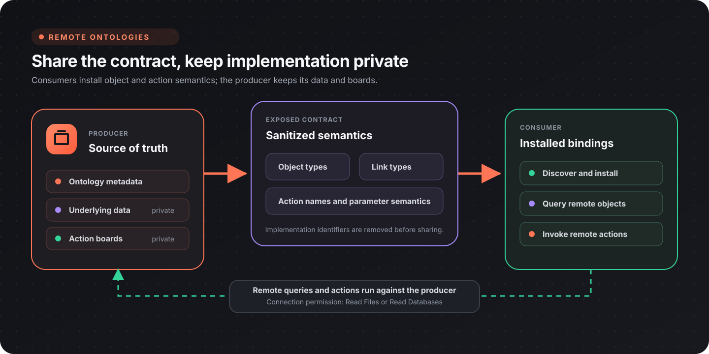
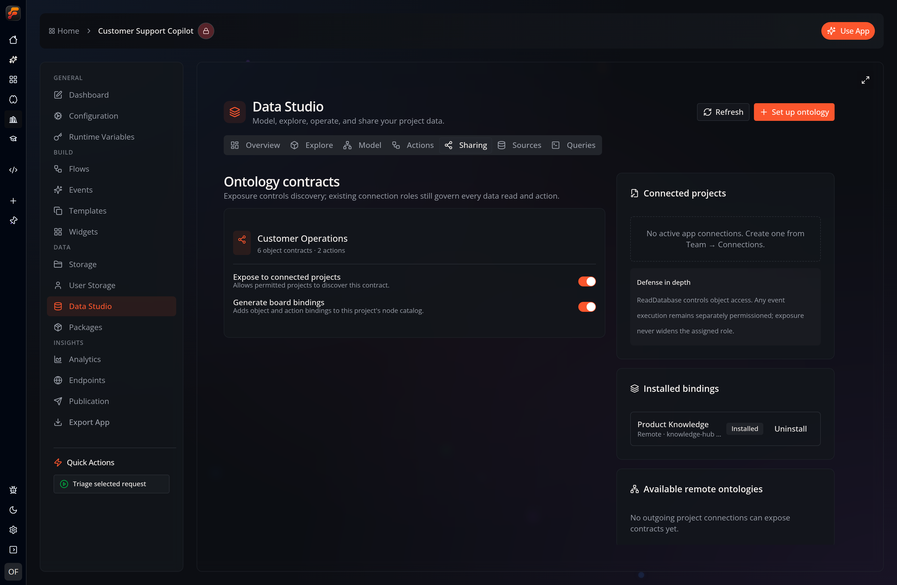

A **remote ontology** lets one project publish its semantic layer as a **contract** that other, connected projects can install and build on — without ever seeing the underlying data or the boards that implement its actions. This is how a shared, organization-wide ontology works: a producer owns the definition, and consumers subscribe to it.

Everything here is in **Data Studio → Sharing**.

## The mental model

- A **producer** exposes an ontology. It stays the source of truth.
- A **consumer** installs a **sanitized copy** of the contract. It gets the object types and the *semantics* of actions — but not the producer's private implementation (board IDs, versions, start nodes are stripped).
- When a consumer invokes a remote action, execution happens **in the producer's project**, which resolves those opaque identifiers itself. The consumer never runs the producer's board directly.

The **Sharing** tab shows both sides of that contract: the producer's exposure and local-binding controls, plus any sanitized contracts already installed from other projects.

:::note[Only exposed contracts are shared]
The discovery endpoint returns *only* ontologies the producer has explicitly exposed. Turning exposure off stops new discovery and installs immediately; existing consumers are denied when they next authorize the ontology.
:::

## Prerequisites: connect the projects

Sharing rides on **app connections**. Before anything appears in the Sharing tab:

1. Create an active connection from the consuming app to the producing app under **Team → Connections**.
2. The consumer needs **Read Boards** in its own project to discover contracts.
3. The connection's role must grant **Read Files or Read Databases** on the producer. Without it, the producer's contracts stay invisible even if exposed.
4. Installing or refreshing a contract also requires **Write Files or Write Databases** in the consuming project.

If there are no active connections, the Sharing tab shows *"No active app connections. Create one from Team → Connections."*

## Producer side: expose an ontology

On each of your ontologies in the Sharing tab there are two switches:

| Switch | Effect |
|--------|--------|
| **Expose to connected projects** | Makes this contract discoverable by permitted connected projects. |
| **Generate board bindings** | Adds this ontology's object and action bindings to *this* project's own node catalog. |

Turning **Expose** on is all a producer has to do. Consumers with a qualifying connection can then discover and install it.

Actions have their own **Expose to connected projects** switch. Only actions enabled for sharing are included in the sanitized remote contract; local-only actions stay private even when the ontology itself is exposed.

## Consumer side: discover and install

The **Available remote ontologies** panel lists your active connections. For each one:

1. **Discover** (or **Refresh**) — calls the connected project and lists the ontology contracts it exposes. Each shows its name and object-type count.
2. **Install** — installs the sanitized contract into your project. Its status badge flips to **Installed**, and the contract's object bindings are added to your node catalog.

An installed contract is labelled **"bindings only"** — a reminder that you receive object semantics and action *definitions*, never the producer's boards.

### Keeping in sync

Each installed contract remembers the producer version it was captured from. **Discover** or **Refresh** compares that version with the current producer contract and can then show **Update available**. Updates are not pushed automatically. Refresh the contract to install the latest sanitized copy and regenerate its bindings.

### Removing one

**Uninstall** removes the contract and its generated bindings from your project. Uninstall works even if the connection is no longer active, so you can always clean up a stale import.

## Using remote data in Data Studio

Installed contracts are first-class, read-only data sources:

- **Explore** lists their object types alongside local ontologies. Remote previews carry source provenance and open a read-only object inspector.
- **Sources** lists the object types supplied by each installed contract.
- **Queries** has a remote-ontology surface for SQL previews. Remote statements run against the producer and cannot be saved as consumer-side queries or views.

The local object sheet deliberately does not invoke remote actions. Use the generated **Invoke Remote Ontology Action** node so the producer can authorize and execute the governed operation.

## Using a remote ontology in boards

Once installed with bindings enabled, the remote ontology contributes nodes to your catalog:

- **Query Remote Ontology Objects** — read objects of a remote object type. This runs against the producer through your connection, honoring the producer's exposure and connection role.
- **Query Remote Ontology Children** — expand a parent object's [containment children](/topics/ontology/overview/#hierarchy--composition) within the installed contract. Like the objects node, it runs against the producer and honors exposure.
- **Invoke Remote Ontology Action** — invoke the producer's governed actions by object reference. The producer executes the pinned board version and enforces its own parameter schema and permissions.

:::note[Remote hierarchies resolve within the exposed contract]
A producer's containment links keep their hierarchy flag when shared, so you can drill down through an installed contract. But a link that pointed at *another* of the producer's ontologies has its target stripped during sanitization — a remote subtree only ever resolves within the exposed contract, never into a producer overlay you weren't given.
:::

## Governance summary

| Guarantee | How |
|-----------|-----|
| Consumers see only what producers allow | Discovery returns exposed contracts only; the connection role must permit reading data |
| No implementation leaks | `board_id`, `board_version`, `start_node_id`, and event IDs are stripped from shared action contracts |
| No cross-ontology leaks | Containment link targets (`dst_ontology`, `dst_binding_id`) are stripped, so a remote subtree can't resolve into a producer overlay that wasn't exposed |
| Actions can't be widened by editing metadata | Each action pins an immutable board version and a contract hash that's re-checked at invoke time |
| Revocation is enforced at authorization | Turning off **Expose** stops new discovery and installs; existing consumers fail at the next workflow run or authorization check (authorization is cached only within a run) |
| Consumers can always clean up | Uninstall never requires the connection to still be active |

## Related

- [Ontology & Knowledge Graph](/topics/ontology/overview/) — object types, link types, the graph explorer, and actions.
